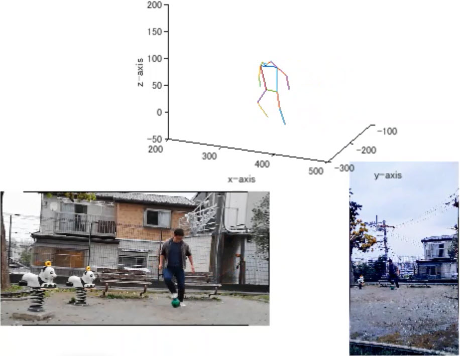

# Title of Demo
2台の汎用カメラによる3次元姿勢推定  
Pose Estimation 3D with stereo camera

## About
このデモはディープニューラルネットワークと汎用のカメラ2台を使って3次元の姿勢推定を行うデモです。  
This demo uses a deep neural network and two generic cameras to perform 3D pose estimation.

## How to Get Started
1. プロジェクトファイルPoseEstimation_in_3D.prjを開き、プロジェクトを開始してください。  
Open the project file "PoseEstimation_in_3D.prj" to start this project.
2. Demosフォルダのmain.mlxを実行するとサンプルデモを開始することができます。  
You can run main.mlx in the Demos folder to start the demo.

## Preparations
デモで使った2台のカメラパラメータは事前に単一カメラキャリブレータAppで計算したものです。  
The camera intrinsic parameters of the two cameras used in the demo were calculated in advance by the Signle Camera Calibrator App.  
<https://www.mathworks.com/help/vision/ug/single-camera-calibrator-app.html>

デモで使う姿勢推定のネットワークは下のGitHubリポジトリからダウンロードし、使えるようにしておきます。  
The network for pose estimation used in the demo can be downloaded from the GitHub repository below. You need to set the path for it to work in use.  <https://github.com/matlab-deep-learning/Human-Pose-Estimation-with-Deep-Learning>

公式のヘルプにも姿勢推定モデルのサンプルがあります。そちらを使っても構いませんが、関係する部分のコードを一部差し替える必要があります。  
There is a sample pose estimation model in the official help. You can use that one, but you will need to replace some of the code in the relevant parts.
[公式の姿勢推定モデルのサンプル-Official sample](https://www.mathworks.com/help/deeplearning/ug/estimate-body-pose-using-deep-learning.html)

## Required Products
MATLAB&reg; R2021a  
Deep Learning Toolbox&trade;  
Computer Vision Toolbox&trade;  
Image Processing Toolbox&trade;  
Signal Processing Toolbox&trade;

Copyright 2021 The MathWorks, Inc.